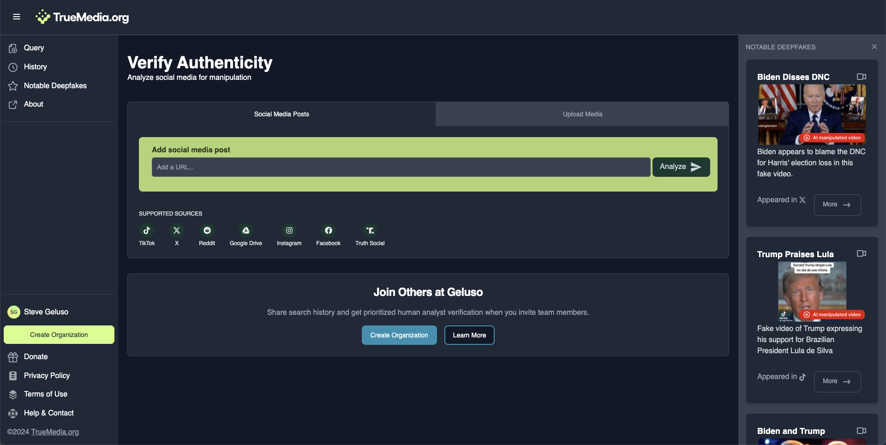

# Users and Organizations

- [About Clerk](#about-clerk)
- [App DB User Table](#app-db-users-table)
- [Creating A User](#creating-a-user)
- [Creating An Organization](#creating-an-organization)
- [Types of User Accounts](#types-of-user-accounts)
- [User Attribution](#user-attribution)
  - [API Keys](#api-keys)
  - [Query Ownership](#query-ownership)
- [Rate Limiting](#rate-limiting)

## About Clerk

Clerk is a third-party authentication and user management service that provides
secure user authentication, organization management, and session handling. We
use Clerk in TrueMedia to:

1. Handle user authentication flows (login, signup, password reset, etc.).
1. Manage user accounts and profile data.
1. Support Single Sign-On (SSO) with providers like Google and Microsoft.
1. Manage organizations and team memberships.

Clerk offloads complex authentication and user management to their
dedicated service. This improves security since Clerk specializes in
authentication best practices, and saves development time since we don't need to
implement features like password reset flows or SSO integrations. Clerk provides
both backend APIs for programmatic access to user data as well as pre-built
React components that handle common authentication UI patterns.

The TrueMedia app supports anonymous users and authenticated users.
Authenticated users can optionally be a member of one or more organizations.
Clerk is the source of truth of user accounts, organizations, and organization
memberships.

Clerk does not store any app information. From Clerk's perspective we use an
external DB which stores app info. The external app DB has a table `Users`. For
each account in Clerk Clerk saves something called `externalId` which refers to
an id in the external app's `Users` table.

Think of Clerk users having two IDs:

1. `id` this ID identifies the user inside Clerk
1. `externalId` allows Clerk to store the ID of the user in an external DB

Again, the TrueMedia app DB is outside of Clerk. Clerk only saves user and
organization information. The external app DB saves things like user queries,
user history, and all other app information. We use `externalId` on Clerk users
to join to other app info.

For example: here is how we can find media queries a user has asked to be
analyzed.

```js
const clerkUser = await clerkClient().users.getUser(clerkUserId)
const queries = await db.query.findMany({ where: { userId: clerkUser.externalId } })
```

## App DB Users Table

The `Users` table in the app (not in Clerk) associates users with queries,
feedback, reruns, rate limits, and API keys.

(There is also an `email` property on the `Users` table in the process of being
deprecated. We store user emails in Clerk now where users can manage their own
email reliably.)

```
model User {
  id            String    @id @default(cuid())
  createdAt     DateTime  @default(now()) @map("created_at")
  updatedAt     DateTime  @default(now()) @map("updated_at")

  queries        Query[]
  feedback       UserFeedback[]
  reruns         Rerun[]
  rateLimits     RateLimit[]
  apiKeys        ApiKey[]       @relation("user")
  createdApiKeys ApiKey[]       @relation("createdBy")

  @@map("users")
}
```

## Creating A User

Users may create accounts in the bottom left nav via a Clerk React component.
Users may create accounts via SSO, or enter an email and create an account by
verifying a code sent to the email.

After creating an account users are forced to accept the terms of service before
they may use the app with account privileges.

Here's a timeline of what happens when a user account is created:

1. A user initiates creating a user account via a call to action button on the site.
1. Clerk prompts the user to create an account via Google or Microsoft SSO, or by providing and verifying an email address.
1. Clerk creates a user account for the user's email address.
1. The site prevents the user from proceeding until the user accepts our Terms of Service.
1. The site calls `onboardNewUser` which saves the user accepting the Terms of
   Services and creates a record in the app's `Users` table. We set the
   `externalId` in Clerk at this point. Any users without `externalId` in Clerk
   haven't accepted our terms yet.

Here's an example of where `onboardNewUser` saves `externalId` back to Clerk.

```
const updatedClerkUser = await clerkClient().users.updateUser(user.id, {
  externalId,
  publicMetadata: { agreedTerms, emailConsent, org },
})
```


## Creating An Organization

Users may create organizations. If a user is not in an org the app shows several
calls to action inviting the user to create an org.



It is possible for a user to be in multiple orgs. They may select an active org
in the lower left nav.


Users can manage their account and their organizations within the Clerk React
components.


## Types of User Accounts

### Anonymous Users

Anonymous users have restricted access submitting queries for analysis.

- Anonymous users may only submit queries to supported sites: TikTok, X,
  Reddit, Instagram, Facebook and Truth Social.
- Anonymous users may not upload files for analysis.
- Anonymous users retain a limited history (10 items) in their browser's local storage.

Users must create accounts if they want to analyze media on an unsupported site,
or to upload their own media directly.

### Authenticated Users

Anyone may create a user account.

- Account users may submit queries from URLs on unsupported sites.
- Account users may upload files for analysis directly.
- Account user history includes all media their account has submitted for analysis.

### Organization Users

Authenticated users may create or join Organizations, like "teams". Users in an
org gain access to an Organization History where all users in the org can see
media submitted for analysis by any user in that org.

- Org users may still submit queries from URLs on unsupported sites.
- Org users may still upload files for analysis directly.
- Org users still retain a view of their individual history.
- Org users gain a second view of the history for their entire org.

Users may create and join multiple orgs. When a user is in multiple orgs they
may use a Clerk React component to select an active org. The user will see their
history based off their selected active org and new queries will be saved to
their selected active org.

## User Attribution

All queries in the app are attributed. This means they belong to a user, and a
org if the user is in an org. The app groups all anonymous users together with a
`userId` of `anonymousanonymousanonymo` since anonymous users don't have account
IDs. Sometimes queries are attributed with an `apiKeyId` which contains `userId`
and `orgId` information.

### API Keys

The app supports API keys which can be generated with a `userId` and `orgId`. A
user must be in an org in order to use an API key.

These API keys can be used to hit three API endpoints:

- `POST /api/resolve-media` - Resolve media from a given URL
- `GET /api/start-analysis` - Start analysis for one media item
- `GET /api/check-analysis` - Check status of the analysis for one media item and retrieve its analysis results

API keys are created by internal users.

- Internal users create API keys at /internal/api-keys
- Users access their API keys and view API docs at /docs/api

The API key is generated randomly and includes a checksum and is stored in the
database with the `userId` and `orgId`. Users can use the API to resolve media,
start analysis for media, and check the analysis for media. Analyzing media via
the API will save queries with the `userId` and `orgId` in the API key.

#### Create API Key


#### Copy API Key


### Query Ownership

Whenever a query is submitted for analysis the app keeps track of the `postUrl`,
`userId`, possibly an `orgId`, possible an `apiKeyId`, and other information.

```
model Query {
  id        String   @id @default(cuid())
  postUrl   String   @map("post_url")
  userId    String   @map("user_id")
  orgId     String?  @map("org_id")
  apiKeyId  String?  @map("api_key_id")

  # ... as well as other information ...
}
```

- `userId` is literally `anonymousanonymousanonymo` if the user is anonymous.
- `orgId` is blank if the user is not currently in an org.
- `orgId` is saved if the user is in an active selected org.
- `apiKeyId` is saved if the request was made via the API with an API key.

When a user joins an org all of that user's individual history becomes
attributed to the org they're joining. The app finds all the queries associated
with the `userId` and rewrites blank `orgId` values with the new `orgId`. Clerk
has a webhook that fires when org members are created. Our webhook endpoint for
this is at `/api/org-member-created`.

If a user leaves an org then the user's queries remain attributed to the org.
The user will not see their org queries in their history since their queries
belong to the org now. For example: consider an employee leaving a news agency.
The ex-employee does not retain access to the agency's news media.

## Rate Limiting

The app rate limits certain actions like resolving media and enqueueing analysis
in the scheduler.

The DB saves `userId` and named actions, like `resolve-media`, and if a user
exceeds pre-defined limits then requests will fail.

```
model RateLimit {
  userId String @map("user_id")
  action String
  times  Int[]
}
```

Here is an example of pre-defined rate limits for resolving media for various
accounts.

- API users may perform 1 request per 1 second.
- All anonymous users (counted all together) may perform 100 requests
  per hour.
- Users with accounts interacting with the website are not rate limited.

```
const perUserRateLimits: Record<UserType, { requests: number; durationSeconds: number } | null> = {
  [UserType.API]: { requests: 10, durationSeconds: 10 },
  [UserType.ANONYMOUS]: { requests: 100, durationSeconds: 3600 },
  [UserType.REGISTERED]: null,
}
```
